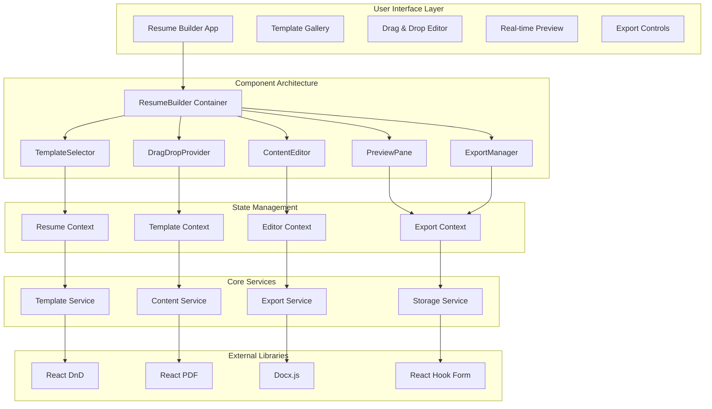

# Design Document

## Overview

The Interactive Resume Builder is a sophisticated React-based feature that transforms the JobRizz platform into a comprehensive resume creation tool. Built entirely with modern frontend technologies, this feature leverages React 18, TypeScript, and a carefully selected ecosystem of libraries to provide a professional-grade resume building experience. The architecture emphasizes real-time interactivity, responsive design, and seamless user experience while maintaining high performance and accessibility standards.

## Architecture



## Components and Interfaces

### Core Component Structure

**ResumeBuilderContainer**
```typescript
interface ResumeBuilderProps {
  initialTemplate?: TemplateType;
  existingResume?: ResumeData;
  onSave?: (resume: ResumeData) => void;
  onExport?: (format: ExportFormat) => void;
}

const ResumeBuilder: React.FC<ResumeBuilderProps> = ({
  initialTemplate,
  existingResume,
  onSave,
  onExport
}) => {
  // Main container component orchestrating the entire builder
  return (
    <DragDropProvider>
      <ResumeProvider>
        <div className="resume-builder-container">
          <TemplateSelector />
          <EditorWorkspace />
          <PreviewPane />
          <ExportControls />
        </div>
      </ResumeProvider>
    </DragDropProvider>
  );
};
```

**Template System Architecture**
```typescript
interface Template {
  id: string;
  name: string;
  category: 'modern' | 'classic' | 'creative' | 'minimal';
  preview: string;
  layout: LayoutConfig;
  styling: StyleConfig;
  sections: SectionConfig[];
}

interface LayoutConfig {
  columns: 1 | 2;
  headerStyle: 'centered' | 'left' | 'split';
  sectionSpacing: number;
  margins: MarginConfig;
}

interface StyleConfig {
  primaryColor: string;
  secondaryColor: string;
  fontFamily: string;
  fontSize: FontSizeConfig;
  lineHeight: number;
}
```

**Drag and Drop System**
```typescript
interface DragDropSection {
  id: string;
  type: SectionType;
  order: number;
  content: SectionContent;
  isVisible: boolean;
  isDragging?: boolean;
}

const DragDropProvider: React.FC<{ children: React.ReactNode }> = ({ children }) => {
  const [sections, setSections] = useState<DragDropSection[]>([]);
  
  const moveSection = useCallback((dragIndex: number, dropIndex: number) => {
    setSections(prev => {
      const newSections = [...prev];
      const draggedSection = newSections[dragIndex];
      newSections.splice(dragIndex, 1);
      newSections.splice(dropIndex, 0, draggedSection);
      return newSections.map((section, index) => ({
        ...section,
        order: index
      }));
    });
  }, []);

  return (
    <DndProvider backend={HTML5Backend}>
      <DragDropContext.Provider value={{ sections, moveSection }}>
        {children}
      </DragDropContext.Provider>
    </DndProvider>
  );
};
```

### Content Management System

**Rich Text Editor Integration**
```typescript
interface ContentEditorProps {
  section: ResumeSection;
  onUpdate: (content: string) => void;
  placeholder?: string;
  maxLength?: number;
}

const ContentEditor: React.FC<ContentEditorProps> = ({
  section,
  onUpdate,
  placeholder,
  maxLength
}) => {
  const [content, setContent] = useState(section.content);
  const [suggestions, setSuggestions] = useState<string[]>([]);
  
  const handleContentChange = useCallback((newContent: string) => {
    setContent(newContent);
    onUpdate(newContent);
    
    // Trigger content suggestions
    if (newContent.length > 10) {
      generateSuggestions(newContent, section.type);
    }
  }, [onUpdate, section.type]);

  return (
    <div className="content-editor">
      <RichTextEditor
        value={content}
        onChange={handleContentChange}
        placeholder={placeholder}
        maxLength={maxLength}
        toolbar={['bold', 'italic', 'bulletList', 'link']}
      />
      {suggestions.length > 0 && (
        <SuggestionPanel suggestions={suggestions} onApply={handleContentChange} />
      )}
    </div>
  );
};
```

**Real-time Preview System**
```typescript
interface PreviewPaneProps {
  template: Template;
  resumeData: ResumeData;
  scale?: number;
}

const PreviewPane: React.FC<PreviewPaneProps> = ({
  template,
  resumeData,
  scale = 1
}) => {
  const previewRef = useRef<HTMLDivElement>(null);
  const [isLoading, setIsLoading] = useState(false);

  const renderSection = useCallback((section: ResumeSection) => {
    const SectionComponent = getSectionComponent(section.type);
    return (
      <SectionComponent
        key={section.id}
        data={section.content}
        styling={template.styling}
        layout={template.layout}
      />
    );
  }, [template]);

  return (
    <div className="preview-pane">
      <div className="preview-controls">
        <ZoomControls scale={scale} onScaleChange={setScale} />
        <PageSizeSelector />
      </div>
      <div 
        ref={previewRef}
        className="preview-container"
        style={{ transform: `scale(${scale})` }}
      >
        {isLoading ? (
          <PreviewSkeleton />
        ) : (
          <div className="resume-preview">
            {resumeData.sections
              .filter(section => section.isVisible)
              .sort((a, b) => a.order - b.order)
              .map(renderSection)}
          </div>
        )}
      </div>
    </div>
  );
};
```

## Data Models

### Resume Data Structure
```typescript
interface ResumeData {
  id: string;
  templateId: string;
  personalInfo: PersonalInfo;
  sections: ResumeSection[];
  styling: CustomStyling;
  metadata: ResumeMetadata;
  versions: ResumeVersion[];
}

interface PersonalInfo {
  firstName: string;
  lastName: string;
  email: string;
  phone: string;
  location: string;
  website?: string;
  linkedin?: string;
  github?: string;
  summary?: string;
}

interface ResumeSection {
  id: string;
  type: SectionType;
  title: string;
  content: SectionContent;
  order: number;
  isVisible: boolean;
  isCustom: boolean;
}

type SectionType = 
  | 'experience' 
  | 'education' 
  | 'skills' 
  | 'projects' 
  | 'certifications' 
  | 'languages' 
  | 'custom';

interface ExperienceContent {
  entries: ExperienceEntry[];
}

interface ExperienceEntry {
  id: string;
  jobTitle: string;
  company: string;
  location: string;
  startDate: string;
  endDate?: string;
  isCurrent: boolean;
  description: string[];
  achievements: string[];
}
```

### Template Configuration
```typescript
interface TemplateConfig {
  layout: {
    type: 'single-column' | 'two-column' | 'sidebar';
    headerHeight: number;
    sectionSpacing: number;
    pageMargins: {
      top: number;
      right: number;
      bottom: number;
      left: number;
    };
  };
  typography: {
    headingFont: string;
    bodyFont: string;
    sizes: {
      h1: number;
      h2: number;
      h3: number;
      body: number;
      small: number;
    };
  };
  colors: {
    primary: string;
    secondary: string;
    text: string;
    accent: string;
    background: string;
  };
  spacing: {
    sectionGap: number;
    itemGap: number;
    lineHeight: number;
  };
}
```

## Error Handling

### Comprehensive Error Management
```typescript
interface ErrorBoundaryState {
  hasError: boolean;
  error?: Error;
  errorInfo?: ErrorInfo;
}

class ResumeBuilderErrorBoundary extends Component<
  { children: ReactNode },
  ErrorBoundaryState
> {
  constructor(props: { children: ReactNode }) {
    super(props);
    this.state = { hasError: false };
  }

  static getDerivedStateFromError(error: Error): ErrorBoundaryState {
    return {
      hasError: true,
      error
    };
  }

  componentDidCatch(error: Error, errorInfo: ErrorInfo) {
    console.error('Resume Builder Error:', error, errorInfo);
    
    // Log error for analytics
    this.logError(error, errorInfo);
    
    // Attempt to save current work
    this.saveCurrentWork();
  }

  private logError = (error: Error, errorInfo: ErrorInfo) => {
    // Implementation for error logging
  };

  private saveCurrentWork = () => {
    try {
      const currentState = this.getCurrentResumeState();
      localStorage.setItem('resume-builder-recovery', JSON.stringify(currentState));
    } catch (e) {
      console.error('Failed to save recovery data:', e);
    }
  };

  render() {
    if (this.state.hasError) {
      return (
        <ErrorRecoveryComponent
          error={this.state.error}
          onRecover={() => this.setState({ hasError: false })}
          onRestart={() => window.location.reload()}
        />
      );
    }

    return this.props.children;
  }
}
```

### Input Validation and Sanitization
```typescript
const validateResumeContent = (content: string, type: SectionType): ValidationResult => {
  const validators = {
    email: (value: string) => /^[^\s@]+@[^\s@]+\.[^\s@]+$/.test(value),
    phone: (value: string) => /^[\+]?[1-9][\d]{0,15}$/.test(value.replace(/\s/g, '')),
    url: (value: string) => {
      try {
        new URL(value);
        return true;
      } catch {
        return false;
      }
    },
    date: (value: string) => !isNaN(Date.parse(value)),
    text: (value: string) => value.trim().length > 0
  };

  const sanitizeHtml = (html: string): string => {
    // Use DOMPurify or similar library
    return DOMPurify.sanitize(html, {
      ALLOWED_TAGS: ['b', 'i', 'u', 'strong', 'em', 'ul', 'ol', 'li', 'br'],
      ALLOWED_ATTR: []
    });
  };

  return {
    isValid: validators[type]?.(content) ?? true,
    sanitizedContent: sanitizeHtml(content),
    errors: []
  };
};
```

## Testing Strategy

### Component Testing with React Testing Library
```typescript
describe('ResumeBuilder', () => {
  const mockResumeData: ResumeData = {
    id: 'test-resume',
    templateId: 'modern-template',
    personalInfo: {
      firstName: 'John',
      lastName: 'Doe',
      email: 'john@example.com',
      phone: '+1234567890',
      location: 'New York, NY'
    },
    sections: [],
    styling: {},
    metadata: {
      createdAt: new Date(),
      updatedAt: new Date(),
      version: 1
    },
    versions: []
  };

  beforeEach(() => {
    localStorage.clear();
  });

  test('renders template selector on initial load', () => {
    render(<ResumeBuilder />);
    expect(screen.getByText('Choose a Template')).toBeInTheDocument();
  });

  test('loads existing resume data correctly', () => {
    render(<ResumeBuilder existingResume={mockResumeData} />);
    expect(screen.getByDisplayValue('John')).toBeInTheDocument();
    expect(screen.getByDisplayValue('Doe')).toBeInTheDocument();
  });

  test('handles drag and drop section reordering', async () => {
    const user = userEvent.setup();
    render(<ResumeBuilder existingResume={mockResumeData} />);
    
    const experienceSection = screen.getByTestId('section-experience');
    const educationSection = screen.getByTestId('section-education');
    
    await user.drag(experienceSection, educationSection);
    
    // Verify sections were reordered
    const sections = screen.getAllByTestId(/section-/);
    expect(sections[0]).toHaveAttribute('data-testid', 'section-education');
    expect(sections[1]).toHaveAttribute('data-testid', 'section-experience');
  });

  test('auto-saves changes to localStorage', async () => {
    const user = userEvent.setup();
    render(<ResumeBuilder />);
    
    const firstNameInput = screen.getByLabelText('First Name');
    await user.type(firstNameInput, 'Jane');
    
    // Wait for auto-save
    await waitFor(() => {
      const savedData = localStorage.getItem('resume-builder-autosave');
      expect(savedData).toContain('Jane');
    }, { timeout: 31000 }); // Auto-save interval is 30s
  });
});
```

### Export Functionality Testing
```typescript
describe('Export Service', () => {
  test('generates PDF with correct content', async () => {
    const mockResume = createMockResume();
    const pdfBlob = await ExportService.exportToPDF(mockResume);
    
    expect(pdfBlob).toBeInstanceOf(Blob);
    expect(pdfBlob.type).toBe('application/pdf');
    
    // Verify PDF content (using pdf-parse or similar)
    const pdfText = await extractTextFromPDF(pdfBlob);
    expect(pdfText).toContain(mockResume.personalInfo.firstName);
    expect(pdfText).toContain(mockResume.personalInfo.email);
  });

  test('generates DOCX with proper formatting', async () => {
    const mockResume = createMockResume();
    const docxBlob = await ExportService.exportToDocx(mockResume);
    
    expect(docxBlob).toBeInstanceOf(Blob);
    expect(docxBlob.type).toBe('application/vnd.openxmlformats-officedocument.wordprocessingml.document');
  });

  test('handles export errors gracefully', async () => {
    const invalidResume = { ...createMockResume(), personalInfo: null };
    
    await expect(ExportService.exportToPDF(invalidResume))
      .rejects
      .toThrow('Invalid resume data');
  });
});
```

### Performance Testing
```typescript
describe('Performance Tests', () => {
  test('renders large resume without performance issues', () => {
    const largeResume = createLargeResumeData(100); // 100 experience entries
    
    const startTime = performance.now();
    render(<ResumeBuilder existingResume={largeResume} />);
    const endTime = performance.now();
    
    expect(endTime - startTime).toBeLessThan(1000); // Should render in under 1 second
  });

  test('drag operations remain smooth with many sections', async () => {
    const resumeWithManySections = createResumeWithSections(20);
    const user = userEvent.setup();
    
    render(<ResumeBuilder existingResume={resumeWithManySections} />);
    
    const firstSection = screen.getAllByTestId(/section-/)[0];
    const lastSection = screen.getAllByTestId(/section-/).slice(-1)[0];
    
    const startTime = performance.now();
    await user.drag(firstSection, lastSection);
    const endTime = performance.now();
    
    expect(endTime - startTime).toBeLessThan(500); // Drag should complete in under 500ms
  });
});
```

## Implementation Architecture

### State Management with Context API
```typescript
interface ResumeContextType {
  resumeData: ResumeData;
  updatePersonalInfo: (info: Partial<PersonalInfo>) => void;
  updateSection: (sectionId: string, content: SectionContent) => void;
  addSection: (type: SectionType) => void;
  removeSection: (sectionId: string) => void;
  reorderSections: (fromIndex: number, toIndex: number) => void;
  saveVersion: (name: string) => void;
  loadVersion: (versionId: string) => void;
  exportResume: (format: ExportFormat) => Promise<Blob>;
}

const ResumeContext = createContext<ResumeContextType | undefined>(undefined);

export const ResumeProvider: React.FC<{ children: ReactNode }> = ({ children }) => {
  const [resumeData, setResumeData] = useState<ResumeData>(getInitialResumeData);
  const [autoSaveTimer, setAutoSaveTimer] = useState<NodeJS.Timeout | null>(null);

  // Auto-save functionality
  useEffect(() => {
    if (autoSaveTimer) {
      clearTimeout(autoSaveTimer);
    }

    const timer = setTimeout(() => {
      saveToLocalStorage(resumeData);
    }, 30000); // Auto-save every 30 seconds

    setAutoSaveTimer(timer);

    return () => {
      if (timer) clearTimeout(timer);
    };
  }, [resumeData]);

  const contextValue: ResumeContextType = {
    resumeData,
    updatePersonalInfo: (info) => {
      setResumeData(prev => ({
        ...prev,
        personalInfo: { ...prev.personalInfo, ...info }
      }));
    },
    updateSection: (sectionId, content) => {
      setResumeData(prev => ({
        ...prev,
        sections: prev.sections.map(section =>
          section.id === sectionId ? { ...section, content } : section
        )
      }));
    },
    // ... other methods
  };

  return (
    <ResumeContext.Provider value={contextValue}>
      {children}
    </ResumeContext.Provider>
  );
};
```

### Export Service Implementation
```typescript
class ExportService {
  static async exportToPDF(resumeData: ResumeData): Promise<Blob> {
    const { jsPDF } = await import('jspdf');
    const doc = new jsPDF();

    // Configure PDF settings
    doc.setFont('helvetica');
    doc.setFontSize(12);

    let yPosition = 20;

    // Add personal information
    doc.setFontSize(16);
    doc.text(`${resumeData.personalInfo.firstName} ${resumeData.personalInfo.lastName}`, 20, yPosition);
    yPosition += 10;

    doc.setFontSize(10);
    doc.text(resumeData.personalInfo.email, 20, yPosition);
    yPosition += 5;
    doc.text(resumeData.personalInfo.phone, 20, yPosition);
    yPosition += 15;

    // Add sections
    for (const section of resumeData.sections.filter(s => s.isVisible)) {
      yPosition = await this.addSectionToPDF(doc, section, yPosition);
      
      // Add new page if needed
      if (yPosition > 250) {
        doc.addPage();
        yPosition = 20;
      }
    }

    return doc.output('blob');
  }

  static async exportToDocx(resumeData: ResumeData): Promise<Blob> {
    const { Document, Packer, Paragraph, TextRun, HeadingLevel } = await import('docx');

    const doc = new Document({
      sections: [{
        properties: {},
        children: [
          // Personal information
          new Paragraph({
            children: [
              new TextRun({
                text: `${resumeData.personalInfo.firstName} ${resumeData.personalInfo.lastName}`,
                bold: true,
                size: 32
              })
            ],
            heading: HeadingLevel.HEADING_1
          }),
          new Paragraph({
            children: [
              new TextRun({
                text: resumeData.personalInfo.email,
                size: 20
              })
            ]
          }),
          // Add sections
          ...this.generateDocxSections(resumeData.sections)
        ]
      }]
    });

    return await Packer.toBlob(doc);
  }

  private static async addSectionToPDF(doc: any, section: ResumeSection, yPosition: number): Promise<number> {
    // Implementation for adding sections to PDF
    doc.setFontSize(14);
    doc.text(section.title, 20, yPosition);
    yPosition += 10;

    // Add section content based on type
    switch (section.type) {
      case 'experience':
        return this.addExperienceToPDF(doc, section.content as ExperienceContent, yPosition);
      case 'education':
        return this.addEducationToPDF(doc, section.content as EducationContent, yPosition);
      // ... other section types
      default:
        return yPosition;
    }
  }

  private static generateDocxSections(sections: ResumeSection[]): Paragraph[] {
    const paragraphs: Paragraph[] = [];

    sections.filter(s => s.isVisible).forEach(section => {
      paragraphs.push(
        new Paragraph({
          children: [
            new TextRun({
              text: section.title,
              bold: true,
              size: 24
            })
          ],
          heading: HeadingLevel.HEADING_2
        })
      );

      // Add section content
      paragraphs.push(...this.generateSectionContent(section));
    });

    return paragraphs;
  }
}
```

This comprehensive design document provides a solid foundation for implementing the Interactive Resume Builder feature. The architecture emphasizes modern React patterns, performance optimization, and user experience while maintaining code quality and testability. The feature can be implemented entirely in the frontend using the specified technologies and libraries.