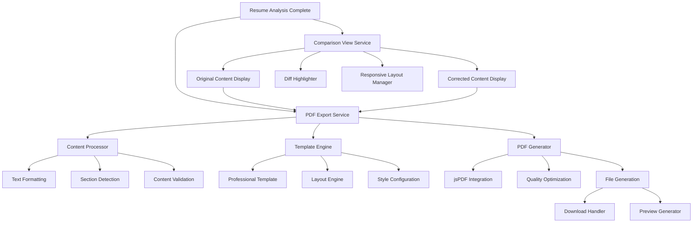

# Design Document

## Overview

The Resume PDF Export feature enables users to download their analyzed resume content as a professionally formatted PDF document, regardless of the original upload format. The system will leverage existing PDF generation libraries (jsPDF and html2canvas) to create high-quality PDF outputs with consistent formatting and professional appearance.

The design focuses on creating a robust, client-side PDF generation system that can handle various content types and formats while maintaining performance and reliability. The solution will integrate seamlessly with the existing resume analysis workflow and provide users with immediate access to their processed resume in PDF format.

## Architecture

### High-Level Architecture



### Component Architecture

The PDF export functionality will be implemented as a modular service with the following key components:

1. **ComparisonViewService**: Manages side-by-side display of original vs corrected content
2. **PDFExportService**: Main orchestrator for PDF generation
3. **ContentProcessor**: Handles content parsing and formatting
4. **TemplateEngine**: Manages PDF layout and styling
5. **DownloadManager**: Handles file generation and download
6. **PreviewGenerator**: Creates PDF previews for user verification
7. **DiffHighlighter**: Highlights differences between original and corrected content

## Components and Interfaces

### 1. ComparisonViewService

```typescript
interface ComparisonData {
  original: {
    content: string;
    sections: ResumeSection[];
    metadata: ContentMetadata;
  };
  corrected: {
    content: string;
    sections: ResumeSection[];
    metadata: ContentMetadata;
    appliedRecommendations: Recommendation[];
  };
  differences: DiffResult[];
}

interface DiffResult {
  type: 'addition' | 'deletion' | 'modification';
  originalText?: string;
  correctedText?: string;
  section: string;
  position: {
    start: number;
    end: number;
  };
  recommendation?: Recommendation;
}

interface ComparisonViewOptions {
  highlightDifferences: boolean;
  showRecommendationTags: boolean;
  layout: 'side-by-side' | 'stacked';
  syncScroll: boolean;
}

class ComparisonViewService {
  static generateComparison(
    analysis: ResumeAnalysis,
    appliedRecommendations: Recommendation[]
  ): ComparisonData;
  
  static highlightDifferences(
    original: string,
    corrected: string
  ): DiffResult[];
  
  static applyCorrections(
    content: string,
    recommendations: Recommendation[]
  ): string;
}
```

### 2. PDFExportService

```typescript
interface PDFExportOptions {
  includeImprovements?: boolean;
  template?: 'professional' | 'modern' | 'classic';
  pageSize?: 'A4' | 'Letter';
  margins?: {
    top: number;
    right: number;
    bottom: number;
    left: number;
  };
}

interface PDFExportResult {
  success: boolean;
  blob?: Blob;
  previewUrl?: string;
  error?: string;
  metadata: {
    pageCount: number;
    fileSize: number;
    generationTime: number;
  };
}

class PDFExportService {
  static async exportResume(
    analysis: ResumeAnalysis,
    options: PDFExportOptions = {}
  ): Promise<PDFExportResult>;
  
  static async generatePreview(
    analysis: ResumeAnalysis,
    options: PDFExportOptions = {}
  ): Promise<string>; // Returns data URL for preview
  
  static async applyImprovements(
    content: string,
    recommendations: Recommendation[]
  ): Promise<string>;
}
```

### 2. ContentProcessor

```typescript
interface ProcessedContent {
  sections: ResumeSection[];
  metadata: {
    wordCount: number;
    estimatedPages: number;
    hasContactInfo: boolean;
  };
}

interface ResumeSection {
  type: 'header' | 'contact' | 'summary' | 'experience' | 'education' | 'skills' | 'other';
  title: string;
  content: string[];
  formatting: {
    isBold?: boolean;
    isItalic?: boolean;
    fontSize?: number;
    indent?: number;
  };
}

class ContentProcessor {
  static processResumeContent(
    extractedText: string,
    analysis: ResumeAnalysis
  ): ProcessedContent;
  
  static detectSections(text: string): ResumeSection[];
  static formatContent(content: string): string[];
  static extractContactInfo(text: string): ContactInfo;
}
```

### 3. TemplateEngine

```typescript
interface TemplateConfig {
  name: string;
  fonts: {
    primary: string;
    secondary: string;
    sizes: {
      header: number;
      subheader: number;
      body: number;
      small: number;
    };
  };
  colors: {
    primary: string;
    secondary: string;
    text: string;
    accent: string;
  };
  spacing: {
    sectionGap: number;
    lineHeight: number;
    paragraphGap: number;
  };
}

class TemplateEngine {
  static getTemplate(name: string): TemplateConfig;
  static applyTemplate(
    doc: jsPDF,
    content: ProcessedContent,
    template: TemplateConfig
  ): void;
  
  static calculateLayout(
    content: ProcessedContent,
    pageSize: string
  ): LayoutInfo;
}
```

### 4. Comparison View Components

```typescript
interface ComparisonViewProps {
  analysis: ResumeAnalysis;
  appliedRecommendations: Recommendation[];
  options: ComparisonViewOptions;
  onExportOriginal: () => void;
  onExportCorrected: () => void;
}

interface DiffHighlightProps {
  text: string;
  differences: DiffResult[];
  type: 'original' | 'corrected';
}

// React Components
const ComparisonView: React.FC<ComparisonViewProps>;
const OriginalResumePanel: React.FC<{ content: string; differences: DiffResult[] }>;
const CorrectedResumePanel: React.FC<{ content: string; differences: DiffResult[] }>;
const DiffHighlight: React.FC<DiffHighlightProps>;
const ExportControls: React.FC<{ onExportOriginal: () => void; onExportCorrected: () => void }>;
```

### 5. PDF Generation Components

```typescript
interface PDFGenerationConfig {
  pageSize: 'A4' | 'Letter';
  orientation: 'portrait' | 'landscape';
  margins: { top: number; right: number; bottom: number; left: number; };
  quality: 'standard' | 'high';
  compression: boolean;
}

class PDFGenerator {
  private doc: jsPDF;
  private config: PDFGenerationConfig;
  private currentY: number;
  
  constructor(config: PDFGenerationConfig);
  
  addHeader(personalInfo: PersonalInfo): void;
  addSection(section: ResumeSection): void;
  addPageBreakIfNeeded(requiredSpace: number): void;
  finalize(): Blob;
}
```

## Data Models

### Enhanced Resume Analysis Types

```typescript
interface PDFExportData extends ResumeAnalysis {
  exportMetadata: {
    originalFormat: string;
    processedAt: Date;
    improvementsApplied: boolean;
    templateUsed: string;
  };
}

interface PersonalInfo {
  name?: string;
  email?: string;
  phone?: string;
  address?: string;
  linkedin?: string;
  website?: string;
}

interface ContactInfo {
  email: string[];
  phone: string[];
  address: string[];
  urls: string[];
}
```

## Error Handling

### Error Types and Recovery Strategies

```typescript
enum PDFExportError {
  CONTENT_PROCESSING_FAILED = 'CONTENT_PROCESSING_FAILED',
  PDF_GENERATION_FAILED = 'PDF_GENERATION_FAILED',
  TEMPLATE_LOADING_FAILED = 'TEMPLATE_LOADING_FAILED',
  INSUFFICIENT_CONTENT = 'INSUFFICIENT_CONTENT',
  BROWSER_COMPATIBILITY = 'BROWSER_COMPATIBILITY',
  MEMORY_LIMIT_EXCEEDED = 'MEMORY_LIMIT_EXCEEDED'
}

class PDFExportErrorHandler {
  static handleError(error: PDFExportError, context: any): PDFExportResult;
  static getRecoveryStrategy(error: PDFExportError): string[];
  static validateBrowserSupport(): boolean;
}
```

### Error Recovery Mechanisms

1. **Content Processing Failures**: Fallback to basic text formatting
2. **PDF Generation Failures**: Retry with simplified template
3. **Memory Issues**: Implement content chunking and compression
4. **Browser Compatibility**: Provide alternative download methods

## Testing Strategy

### Unit Testing

1. **Content Processing Tests**
   - Test section detection accuracy
   - Validate text formatting preservation
   - Test contact information extraction

2. **PDF Generation Tests**
   - Test template application
   - Validate page layout calculations
   - Test multi-page document handling

3. **Integration Tests**
   - End-to-end PDF generation workflow
   - Test with various input formats
   - Validate output quality and consistency

### Performance Testing

1. **Load Testing**
   - Test with large resume files (>10 pages)
   - Memory usage monitoring
   - Generation time benchmarks

2. **Browser Compatibility Testing**
   - Test across major browsers (Chrome, Firefox, Safari, Edge)
   - Mobile browser compatibility
   - Performance on low-end devices

### Quality Assurance

1. **Visual Testing**
   - PDF output visual regression testing
   - Template consistency validation
   - Font and formatting verification

2. **Accessibility Testing**
   - PDF accessibility compliance
   - Screen reader compatibility
   - Text selection and search functionality

## Implementation Phases

### Phase 1: Side-by-Side Comparison View
- Implement ComparisonViewService
- Create responsive comparison UI components
- Develop difference highlighting system
- Add basic correction application logic

### Phase 2: Core PDF Generation
- Implement basic PDFExportService
- Create ContentProcessor for text parsing
- Develop simple professional template
- Add basic error handling

### Phase 3: Enhanced Features
- Implement preview functionality
- Add multiple template options
- Integrate improvement suggestions
- Add progress indicators

### Phase 4: Optimization and Polish
- Performance optimization
- Advanced error recovery
- Mobile responsiveness
- Accessibility improvements

## Technical Considerations

### Performance Optimization

1. **Lazy Loading**: Load PDF generation libraries only when needed
2. **Web Workers**: Consider using web workers for heavy processing
3. **Caching**: Cache processed content and templates
4. **Compression**: Implement PDF compression for smaller file sizes

### Browser Compatibility

1. **Feature Detection**: Check for required browser APIs
2. **Polyfills**: Provide fallbacks for older browsers
3. **Progressive Enhancement**: Graceful degradation for unsupported features

### Security Considerations

1. **Content Sanitization**: Sanitize user content before PDF generation
2. **File Size Limits**: Implement reasonable file size restrictions
3. **Memory Management**: Prevent memory leaks during generation
4. **Client-Side Processing**: Keep all processing client-side for privacy

## Integration Points

### Existing System Integration

1. **Resume Analysis Integration**: Seamlessly integrate with existing analysis workflow
2. **UI Components**: Add export buttons to analysis results pages
3. **File Management**: Integrate with existing file handling systems
4. **Error Handling**: Consistent error handling with existing patterns

### Future Extensibility

1. **Template System**: Extensible template architecture for future designs
2. **Export Formats**: Foundation for additional export formats (Word, HTML)
3. **Customization**: User preference system for export settings
4. **API Integration**: Potential for server-side PDF generation in the future